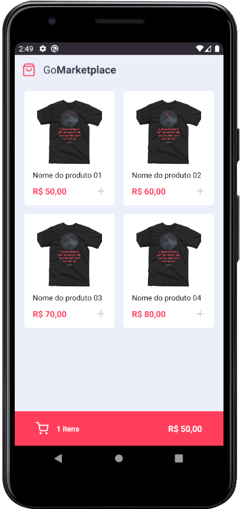

<h1 align="center">
  <a href="https://github.com/lucasmontano/openweathermap-react-native">
    
  </a>
</h1>

<h2 align="center">
  React Native GoMarketplace App
</h2>

**GoMarketplace** was a project developed for Rocketseat's GoStack Bootcamp with the aim of putting into practice what we learned along the way.

The goal is for it to be a shopping app, where we have a list of products and a cart.

<p align="center">
  <a href="https://github.com/Eduardo-SO">
    
  </a>

  

  
</p>

<div align="center">
  
  
</div>

---

## Table of Contents
<div>
  <ul>
    <li><a href="#technologies-used">Technologies used</a></li>
    <li><a href="#getting-started">Getting Started</a></li>
    <li><a href="#run-the-app">Run the app</a></li>
  </ul>
</div>

---

## Technologies used

- Core
  - [React Native](https://reactnative.dev/) - A framework for building native apps with React
  - [Typescript](https://www.typescriptlang.org/) - A typed superset of JavaScript that compiles to plain JavaScript
- Navigation
  - [React Navigation](https://reactnavigation.org/) - Routing and navigation for your React Native apps
- Styling
  - [Styled Components](https://styled-components.com/) - Use the best bits of ES6 and CSS to style your apps without stress
- Server
  - [JSON Server](https://github.com/typicode/json-server) - Allow the creation of a complete fake REST API
- Linting
  - [ESLint](https://github.com/eslint/eslint) - Find and fix problems in your JavaScript code
  - [Prettier](https://prettier.io/) - Prettier is an opinionated code formatter
- Tests
  - [Jest](https://jestjs.io/) - Delightful JavaScript Testing Framework with a focus on simplicity


---

## Getting Started

### Prerequisites

- To run any React Native application you need to configure the environment on your machine.

- Setting the environment is a complex process, so it's recommended to follow the Rocketseat guide which is currently the most complete and detailed to make the settings:

#### [**Rocketseat Guide (pt-BR)**](https://react-native.rocketseat.dev/)

---

## Run the app

- Clone this repo to your local machine using:

```bash
$ git clone https://github.com/Eduardo-SO/GoMarketplace
```

- Go into the repository

```bash
$ cd GoMarketplace
```

- Install dependencies

```bash
$ yarn install
```

- Run the server

```bash
$ yarn json-server server.json -p 3333
```

- Set device port to machine port

```bash
$ adb reverse tcp:3333 tcp:3333
```

- Run the app

```bash
# On IOS
$ react-native ios

# On Android
$ react-native android
```
---

## License
This project is under the MIT license. See the [LICENSE](https://github.com/Eduardo-SO/GoMarketplace/blob/master/LICENSE) for more information.
